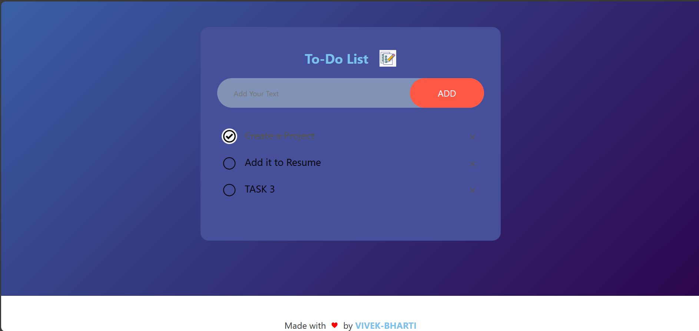

# To-Do List App

A simple and elegant **To-Do List** web application that allows users to add, check off, and remove tasks. The app also saves the user's list in their browser's local storage, so the tasks persist even after a page reload.

## Features

- Add new tasks by clicking the **ADD** button or pressing the **Enter** key.
- Mark tasks as complete by clicking on them.
- Remove tasks by clicking the **×** button next to each task.
- Saves tasks in **local storage** so that the list persists between browser sessions.

## Demo

You can try out the application here: [Live Demo Link](https://vivek-1208.github.io/To-Do-List/)


## Installation

1. Clone the repository:

    ```bash
    git clone https://github.com/VIVEK-1208/To-Do-List.git
    ```

2. Navigate to the project directory:

    ```bash
    cd To-Do List
    ```

3. Open `index.html` in your browser to start using the app.

## File Structure

- **index.html**: Contains the structure of the To-Do List application.
- **styles.css**: Contains the styling for the To-Do List.
- **script.js**: Includes all JavaScript functionality (adding tasks, marking tasks as complete, saving to local storage, etc.).

## Technologies Used

- **HTML5**
- **CSS3**
- **JavaScript**

## Credits

Made with ❤️ by [VIVEK-BHARTI](https://github.com/YOUR-USERNAME)
